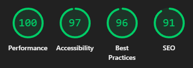
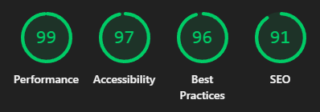

<!-- Improved compatibility of back to top link: See: https://github.com/othneildrew/Best-README-Template/pull/73 -->

<a id="readme-top"></a>

<!--
*** Thanks for checking out the Best-README-Template. If you have a suggestion
*** that would make this better, please fork the repo and create a pull request
*** or simply open an issue with the tag "enhancement".
*** Don't forget to give the project a star!
*** Thanks again! Now go create something AMAZING! :D
-->

<!-- PROJECT SHIELDS -->
<!--
*** I'm using markdown "reference style" links for readability.
*** Reference links are enclosed in brackets [ ] instead of parentheses ( ).
*** See the bottom of this document for the declaration of the reference variables
*** for contributors-url, forks-url, etc. This is an optional, concise syntax you may use.
*** https://www.markdownguide.org/basic-syntax/#reference-style-links
-->

<div align="center">

[![Contributors][contributors-shield]][contributors-url]
[![Forks][forks-shield]][forks-url]
[![Stargazers][stars-shield]][stars-url]
[![Issues][issues-shield]][issues-url]
[![MIT License][license-shield]][license-url]

![GitHub Last Commit][last-commit-shield]
![GitHub Repo Size][repo-size-shield]

</div>

<!-- PROJECT LOGO -->
<br />
<div align="center">
  <h1 align="center">Space Tourism Website</h1>

  <p align="center">
    🚀 Верстка многостраничного адаптивного сайта для вымышленной компании, предоставляющей услуги космического туризма.
    <br />
    <br />
    <a href="https://www.frontendmentor.io/challenges/space-tourism-multipage-website-gRWj1URZ3">Дизайн (макет)</a>
    &middot;
    <a href="https://aleethey.github.io/Space-Tourism-Website/">Демо</a>
    &middot;
    <a href="https://github.com/aLeeTheY/Space-Tourism-Website/issues/new?labels=bug&template=bug-report---.md">Сообщить об ошибке</a>
  </p>

[](README.md)
[](README.ENG.md)

</div>

<!-- TABLE OF CONTENTS -->
<br />
<details>
  <summary>Содержание</summary>
  <ol>
    <li>
      <a href="#о-проекте">О проекте</a>
      <ul>
        <li><a href="#дизайн">Дизайн</a></li>
        <li><a href="#предпросмотр">Предпросмотр</a></li>
        <li><a href="#ключевые-особенности">Ключевые особенности</a></li>
        <ul>
          <li><a href="#google-lighthouse-benchmark">Google Lighthouse Benchmark</a></li>
        </ul>
        <li><a href="#используемые-технологии">Используемые технологии</a></li>
        <li><a href="#структура-проекта">Структура проекта</a></li>
        <li><a href="#поддерживаемые-браузеры">Поддерживаемые браузеры</a></li>
      </ul>
    </li>
    <li>
      <a href="#начало-работы">Начало работы</a>
      <ul>
        <li><a href="#предварительные-требования">Предварительные требования</a></li>
        <li><a href="#установка-зависимостей">Установка зависимостей</a></li>
        <li><a href="#сборка-статических-файлов">Сборка статических файлов</a></li>
      </ul>
    </li>
    <li>
      <a href="#использование">Использование</a>
      <ul>
        <li><a href="#доступные-команды">Доступные команды</a></li>
      </ul>
    </li>
    <li><a href="#сложности-при-разработке">Сложности при разработке</a></li>
    <li><a href="#полученные-навыки">Полученные навыки</a></li>
    <li><a href="#дорожная-карта">Дорожная карта</a></li>
    <li><a href="#лицензия">Лицензия</a></li>
    <li><a href="#контакты">Контакты</a></li>
    <li><a href="#благодарности">Благодарности</a></li>
  </ol>
</details>

<!-- ABOUT THE PROJECT -->

## О проекте

Основная цель проекта — разработка многостраничного адаптивного сайта для отработки навыков работы с технологиями **Sass** и **TypeScript**.

Проект реализован без использования фреймворков и CMS-систем, с акцентом на чистую и понятную архитектуру.  
**Sass** используется для организации и масштабирования стилей, а **TypeScript** — для реализации клиентской логики переключения вкладок.

### Дизайн

Дизайн сайта основан на макете [**Space Tourism**](https://www.frontendmentor.io/challenges/space-tourism-multipage-website-gRWj1URZ3), разработанном в [**Figma**](https://www.figma.com/) и предоставленном платформой [**Frontend Mentor**](https://www.frontendmentor.io/).

В рамках проекта основной задачей было воспроизведение предложенного интерфейса с максимальной точностью и адаптация его под различные разрешения экранов.

### Предпросмотр

Ниже представлен **предварительный просмотр** сайта (_**Desktop + Mobile**, нажмите на изображение для перехода к демо_):

<div align="center">

[![Предпросмотр сайта][website-preview]](https://aleethey.github.io/Space-Tourism-Website/)

</div>

### Ключевые особенности

- **Адаптивность**: Сайт полностью адаптирован под форматы Desktop, Tablet и Mobile с использованием медиазапросов CSS.
- **Pixel Perfect**: Верстка максимально соответствует дизайн-макету.
- **UX/UI**: Плавные анимации улучшают визуальное восприятие интерфейса.
- **Методология БЭМ**: Нейминг CSS-классов соответствует методологии БЭМ (Блок — Элемент — Модификатор).
- **Процесс сборки**: Использование современных инструментов позволяет упростить разработку и расширить возможности стандартных CSS и JavaScript.
- **Статический контент**: Сайт не использует CMS или серверную генерацию страниц.
- **Легковесность**: Проект набирает **100/100 баллов в [Google Lighthouse](https://developer.chrome.com/docs/lighthouse/overview) по метрике Performance** и **90+ по остальным метрикам**.
- **Универсальность шаблона**: Проект может использоваться как шаблон для создания других статических сайтов.

#### Google Lighthouse Benchmark

В доказательство набранных баллов в бенчмарке **Google Lighthouse**, ниже представлены их результаты (**Desktop + Mobile**):

<div align="center">

|                             Desktop                              |                             Mobile                             |
| :--------------------------------------------------------------: | :------------------------------------------------------------: |
|  |  |

</div>

### Используемые технологии

Проект создан с использованием следующих инструментов и технологий:

- **FRONTEND**:
  - [![HTML][HTML-logo]][HTML-url]
  - [![Sass][Sass-logo]][Sass-url]
  - [![TypeScript][TypeScript-logo]][TypeScript-url]

  - **BUILD TOOLS**:
    - [![Node.js][NodeJS-logo]][NodeJS-url]
    - [![Npm][Npm-logo]][Npm-url]

- **VERSION CONTROL SYSTEM**:
  - [![Git][Git-logo]][Git-url]

### Структура проекта

Основные каталоги и файлы проекта:

```text
Space-Tourism-Website/
│
├── .vscode/
│   └── tasks.json           # файл расширения 'spencerwmiles.vscode-task-buttons'
│
├── project/                 # прочие проектные файлы
│   └── preview/
│
├── public/                  # скомпилированные файлы проекта и ассеты
│   ├── assets/              # изображения и статические ресурсы
│   ├── css/
│   ├── js/
│   ├── crew.html
│   ├── destination.html
│   ├── favicon.ico
│   ├── index.html
│   └── technology.html
│
├── src/
│   ├── scss/                # исходные Sass-файлы
│   └── ts/                  # исходные TypeScript-файлы
│
├── .gitignore
├── LICENSE
├── package-lock.json
├── package.json             # конфигурация проекта и зависимости
├── README.ENG.md
├── README.md
└── tsconfig.json            # конфигурация TypeScript
```

### Поддерживаемые браузеры

Проект проверен на корректность отображения и стабильность работы скриптов в актуальных версиях следующих браузеров:

- [![Google Chrome][GoogleChrome-logo]][GoogleChrome-url]
- [![Microsoft Edge][MicrosoftEdge-logo]][MicrosoftEdge-url]
- [![Yandex][Yandex-logo]][Yandex-url]
- [![Firefox][Firefox-logo]][Firefox-url]
- [![Opera][Opera-logo]][Opera-url]

> [!IMPORTANT]
> Информация актуальна для версии **[1.0.5](https://github.com/aLeeTheY/Space-Tourism-Website/releases/tag/1.0.5)**. На момент проверки проект корректно отображался в последних стабильных версиях всех [указанных браузеров](#поддерживаемые-браузеры).
>
> **Дата последней проверки: 10 февраля 2026**

<p align="right">(<a href="#readme-top">наверх</a>)</p>

<!-- GETTING STARTED -->

## Начало работы

_Следуйте приведённым ниже инструкциям для сборки и запуска проекта на локальном сервере._

### Предварительные требования

Установите [Node.js][NodeJS-url].

Затем скачайте данный репозиторий в виде ZIP-архива или клонируйте его с помощью [Git][Git-url]:

```sh
git clone https://github.com/aLeeTheY/Space-Tourism-Website
```

### Установка зависимостей

Перейдите в каталог проекта и установите все необходимые зависимости:

```sh
npm install
```

### Сборка статических файлов

Выполните следующую команду, чтобы скомпилировать Sass и TypeScript файлы в файлы CSS и JavaScript:

```sh
npm run build:release
```

<p align="right">(<a href="#readme-top">наверх</a>)</p>

## Использование

После завершения этапа [**Начало работы**](#начало-работы), вы можете открыть сайт вручную, запустив файл `index.html` из папки `public/` в любом поддерживаемом браузере.

Также вы можете запустить сайт на локальном сервере (`localhost`) следующей командой:

```sh
npm run serve
```

### Доступные команды

В проекте используются следующие команды `npm`:

<div align="center">

|         Команда          |                                            Описание                                             |
| :----------------------: | :---------------------------------------------------------------------------------------------: |
|     `npm run clean`      |                      Удаление всех скомпилированных ранее CSS и JS файлов                       |
|    `npm run build:ts`    |                                  Компиляция обычных JS-файлов                                   |
|  `npm run build:ts:min`  |                              Компиляция минифицированных JS-файлов                              |
|  `npm run build:ts:all`  |                         Компиляция обычных и минифицированных JS-файлов                         |
|   `npm run build:scss`   |                                  Компиляция обычных CSS-файлов                                  |
| `npm run build:scss:min` |                             Компиляция минифицированных CSS-файлов                              |
| `npm run build:scss:all` |                        Компиляция обычных и минифицированных CSS-файлов                         |
|    `npm run watch:ts`    |               Автоматическая компиляция обычных JS-файлов при изменении TS-файлов               |
|  `npm run watch:ts:min`  |          Автоматическая компиляция минифицированных JS-файлов при изменении TS-файлов           |
|  `npm run watch:ts:all`  |     Автоматическая компиляция обычных и минифицированных JS-файлов при изменении TS-файлов      |
|   `npm run watch:scss`   |          Автоматическая компиляция обычных CSS-файлов при изменении SCSS-файлов (Sass)          |
| `npm run watch:scss:min` |     Автоматическая компиляция минифицированных CSS-файлов при изменении SCSS-файлов (Sass)      |
| `npm run watch:scss:all` | Автоматическая компиляция обычных и минифицированных JS-файлов при изменении SCSS-файлов (Sass) |
|     `npm run watch`      |                    Автоматическая компиляция JS и CSS при изменении TS/SCSS                     |
|  `npm run build:debug`   |                      Сборка обычных JS и CSS одновременно (для разработки)                      |
| `npm run build:release`  |                         Сборка минифицированных JS и CSS для продакшена                         |
|     `npm run serve`      |             Запуск локального сервера (`localhost`, для разработки / тестирования)              |
|     `npm run start`      |                 Сборка JS и CSS в режиме `release` + запуск локального сервера                  |

</div>

<p align="right">(<a href="#readme-top">наверх</a>)</p>

## Сложности при разработке

- **Позиционирование элементов**: Дизайн-макет не всегда явно указывал на иерархию элементов при построении DOM-структуры.
- **Типография**: Требовалось отделить типографические классы от остальных стилей, чтобы избежать избыточного кода.
- **Многофайловый Sass**: Необходимо было грамотно организовать структуру Sass-файлов, чтобы отделить стили компонентов и страниц.
- **Адаптивность**: При разработке адаптивной версии сайта требовалось учитывать большое количество элементов, стили которых изменяются в зависимости от устройства. Некоторые различия сводились всего к 1–2 CSS-свойствам, что усложняло поиск и исправление несоответствий.

<p align="right">(<a href="#readme-top">наверх</a>)</p>

## Полученные навыки

- **UI/UX дизайн**: Работа с готовыми дизайн-макетами и их перенос в HTML/CSS.
- **Методология БЭМ**: Создание понятной и масштабируемой структуры CSS-классов с использованием методологии БЭМ.
- **TypeScript**: Реализация клиентской логики переключения вкладок.
- **Адаптивная верстка**: Разработка многостраничного адаптивного интерфейса.
- **Документация и GitHub**: Оформление документации и README.md файлов с использованием Markdown, ведение версионного контроля через Git.
- **Управление зависимостями и сборка**: Использование `npm` для управления зависимостями и сборки проекта.

<p align="right">(<a href="#readme-top">наверх</a>)</p>

<!-- ROADMAP -->

## Дорожная карта

- [x] Разработка HTML-документов и стилизация CSS для страниц:
  - [x] `index.html`
  - [x] `destination.html`
  - [x] `crew.html`
  - [x] `technology.html`
- [x] Внедрение адаптивности для **Tablet**
- [x] Внедрение адаптивности для **Mobile**
- [x] Верификация соответствия результата дизайн-макету
- [x] Подготовка документации для GitHub

Полный список планируемых функций и известных проблем доступен в разделе [Issues][issues-url].

<p align="right">(<a href="#readme-top">наверх</a>)</p>

<!-- LICENSE -->

## Лицензия

Copyright © 2025 [aLeeTheY](https://github.com/aLeeTheY)
<br/>
Проект распространяется по лицензии [MIT][license-url]. Смотрите файл `LICENSE` для получения подробной информации.

<p align="right">(<a href="#readme-top">наверх</a>)</p>

<!-- CONTACT -->

## Контакты

GitHub: [aLeeTheY](https://github.com/aLeeTheY)
<br/>
Email: [aleethey@gmail.com](mailto:aleethey@gmail.com)

<p align="right">(<a href="#readme-top">наверх</a>)</p>

<!-- ACKNOWLEDGMENTS -->

## Благодарности

[aLeeTheY](https://github.com/aLeeTheY) выражает благодарность разработчикам и сообществам следующих проектов:

- [Figma](https://www.figma.com/)
- [Frontend Mentor](https://www.frontendmentor.io/)
- [Visual Studio Code](https://code.visualstudio.com/)
- [Sass](https://sass-lang.com/)
- [TypeScript](https://www.typescriptlang.org/)
- [Node.js](https://nodejs.org/)
- [Npm](https://www.npmjs.com/)
- [Git](https://git-scm.com/)
- [GitHub](https://github.com/)
- [Chocolatey](https://chocolatey.org/)
- [FFmpeg](https://www.ffmpeg.org/)
- [gifsicle](https://github.com/kohler/gifsicle)
- [Chrome DevTools](https://developer.chrome.com/docs/devtools)
- [Lighthouse](https://developer.chrome.com/docs/lighthouse/overview)

Без этих инструментов разработка данного проекта была бы **невозможна**.

<p align="right">(<a href="#readme-top">наверх</a>)</p>

<!-- MARKDOWN LINKS & IMAGES -->
<!-- https://www.markdownguide.org/basic-syntax/#reference-style-links -->

[contributors-shield]: https://img.shields.io/github/contributors/aLeeTheY/Space-Tourism-Website.svg?style=for-the-badge
[contributors-url]: https://github.com/aLeeTheY/Space-Tourism-Website/graphs/contributors
[forks-shield]: https://img.shields.io/github/forks/aLeeTheY/Space-Tourism-Website.svg?style=for-the-badge
[forks-url]: https://github.com/aLeeTheY/Space-Tourism-Website/network/members
[stars-shield]: https://img.shields.io/github/stars/aLeeTheY/Space-Tourism-Website.svg?style=for-the-badge
[stars-url]: https://github.com/aLeeTheY/Space-Tourism-Website/stargazers
[issues-shield]: https://img.shields.io/github/issues/aLeeTheY/Space-Tourism-Website.svg?style=for-the-badge
[issues-url]: https://github.com/aLeeTheY/Space-Tourism-Website/issues
[license-shield]: https://img.shields.io/github/license/aLeeTheY/Space-Tourism-Website.svg?style=for-the-badge
[license-url]: https://github.com/aLeeTheY/Space-Tourism-Website/blob/main/LICENSE
[last-commit-shield]: https://img.shields.io/github/last-commit/aLeeTheY/Space-Tourism-Website?style=for-the-badge
[repo-size-shield]: https://img.shields.io/github/repo-size/aLeeTheY/Space-Tourism-Website?style=for-the-badge
[HTML-logo]: https://img.shields.io/badge/HTML-%23E34F26.svg?logo=html5&logoColor=white&style=for-the-badge
[HTML-url]: https://html.spec.whatwg.org/
[Sass-logo]: https://img.shields.io/badge/Sass-C69?logo=sass&logoColor=fff&style=for-the-badge
[Sass-url]: https://sass-lang.com/
[TypeScript-logo]: https://img.shields.io/badge/TypeScript-3178C6?logo=typescript&logoColor=fff&style=for-the-badge
[TypeScript-url]: https://www.typescriptlang.org/
[Git-logo]: https://img.shields.io/badge/Git-F05032?logo=git&logoColor=fff&style=for-the-badge
[Git-url]: https://git-scm.com/
[NodeJS-logo]: https://img.shields.io/badge/Node.js-6DA55F?logo=node.js&logoColor=white&style=for-the-badge
[NodeJS-url]: https://nodejs.org/
[Npm-logo]: https://img.shields.io/badge/npm-CB3837?logo=npm&logoColor=fff&style=for-the-badge
[Npm-url]: https://www.npmjs.com/
[Opera-logo]: https://img.shields.io/badge/Opera-FF1B2D?logo=Opera&logoColor=white&style=for-the-badge
[Opera-url]: https://www.opera.com/
[GoogleChrome-logo]: https://img.shields.io/badge/Google%20Chrome-4285F4?logo=GoogleChrome&logoColor=white&style=for-the-badge
[GoogleChrome-url]: https://www.google.com/chrome/
[MicrosoftEdge-logo]: https://custom-icon-badges.demolab.com/badge/Microsoft%20Edge-2771D8?logo=edge-white&logoColor=white&style=for-the-badge
[MicrosoftEdge-url]: https://www.microsoft.com/en-us/edge/
[Firefox-logo]: https://img.shields.io/badge/Firefox-FF7139?logo=firefoxbrowser&logoColor=white&style=for-the-badge
[Firefox-url]: https://www.firefox.com/
[Yandex-logo]: https://custom-icon-badges.demolab.com/badge/Yandex%20Browser-F03911?logo=yandex-browser&style=for-the-badge
[Yandex-url]: https://browser.yandex.com/
[website-preview]: project/preview/combined.gif
